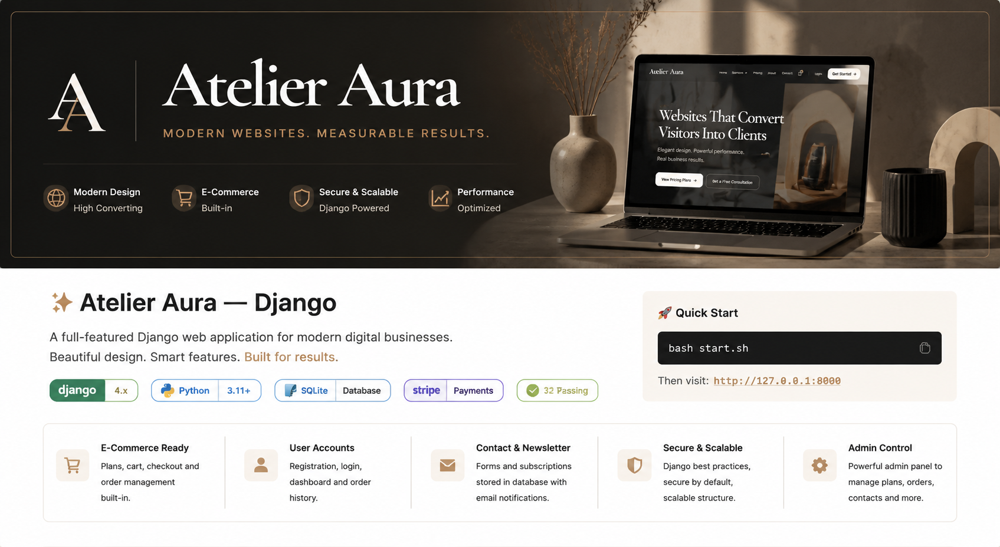
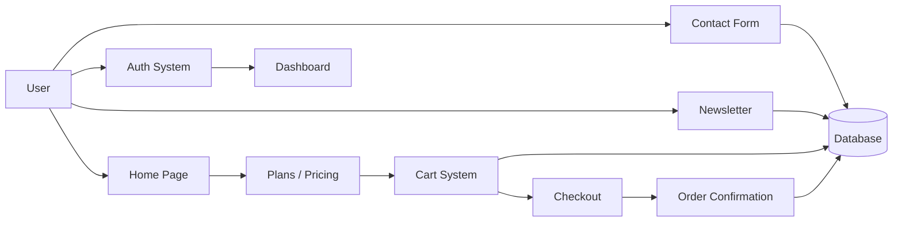

<div align="center">



# ✨ Atelier Aura

### Modern Django Web Application for High-Converting Digital Experiences

<p align="center">
  
  
  
  
  
</p>

---

📦 Production-ready Django platform with authentication, cart system, checkout flow, email automation, and admin management.

</div>

---

## 🧭 System Overview



---

## ✨ Key Features

### 🏠 Core Experience
- Landing page with hero section
- Services showcase
- Pricing preview
- Conversion focused CTA flow

### 🛒 E-Commerce System
- Dynamic pricing plans from database
- Session-based cart for guests
- User-linked cart for logged-in users
- Secure checkout flow
- Order confirmation with reference ID

### 👤 Authentication System
- User registration and login
- Secure logout
- User dashboard with order history

### 📬 Communication Layer
- Contact form with database storage
- Email notifications to admin
- Newsletter subscription system

### ⚙️ Admin Control Panel
- Manage pricing plans
- Manage orders and users
- View contacts and subscribers
- Full Django admin integration

---

## 🧱 Project Structure

```
atelierAura/
├── atelierAura/
├── core/
├── accounts/
├── shop/
├── templates/
├── seed_data.py
├── start.sh
└── db.sqlite3
```

---

## 🚀 Quick Start

```bash
bash start.sh
```

Open:
http://127.0.0.1:8000

---

## 🔐 Admin Access

- URL: http://127.0.0.1:8000/admin/
- Username: admin
- Password: Admin@2026!

---

## 💳 Stripe Setup

```python
STRIPE_PUBLIC_KEY = "pk_live_..."
STRIPE_SECRET_KEY = "sk_live_..."
```

---

## 📧 Email Setup

```python
EMAIL_BACKEND = "django.core.mail.backends.smtp.EmailBackend"
EMAIL_HOST = "smtp.yourprovider.com"
EMAIL_PORT = 587
EMAIL_USE_TLS = True
EMAIL_HOST_USER = "your@email.com"
EMAIL_HOST_PASSWORD = "yourpassword"
```

---

## 🧪 Tests

```bash
python manage.py test
```

32 tests across all apps.

---

## 📌 Highlights

✔ Authentication system  
✔ Cart and checkout flow  
✔ Dynamic pricing system  
✔ Email automation  
✔ Admin dashboard  
✔ Production-ready Django structure  

---

<div align="center">

### Built with Django ⚡

</div>
